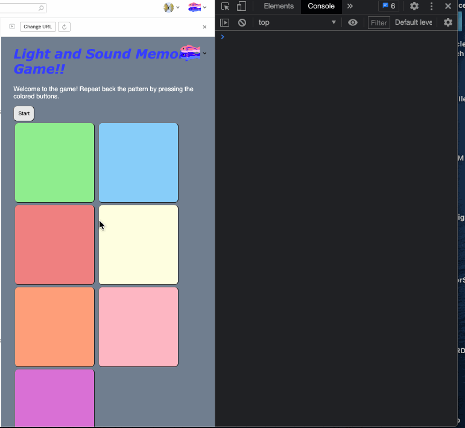
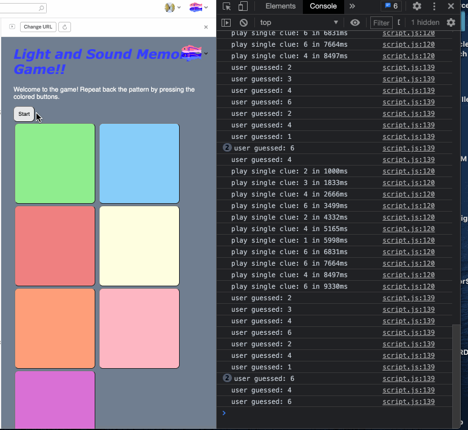
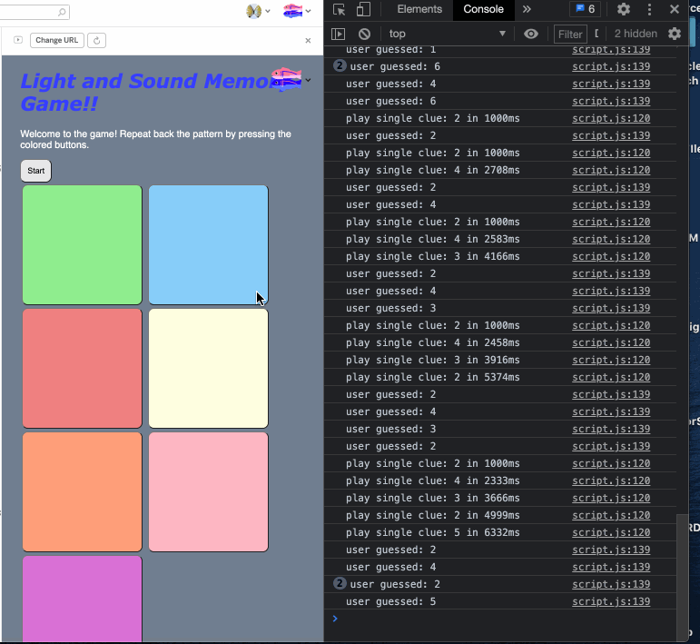

# Pre-work - *Memory Game*

**Memory Game** is a Light & Sound Memory game to apply for CodePath's SITE Program. 

Submitted by: **Hilarion James Reyess**

Time spent: **8** hours spent in total

Link to project: (insert your link here, should start with https://glitch.com...)

## Required Functionality

The following **required** functionality is complete:

* [x] Game interface has a heading (h1 tag), a line of body text (p tag), and four buttons that match the demo app
* [x] "Start" button toggles between "Start" and "Stop" when clicked. 
* [x] Game buttons each light up and play a sound when clicked. 
* [x] Computer plays back sequence of clues including sound and visual cue for each button
* [x] Play progresses to the next turn (the user gets the next step in the pattern) after a correct guess. 
* [x] User wins the game after guessing a complete pattern
* [x] User loses the game after an incorrect guess

The following **optional** features are implemented:

* [X] Any HTML page elements (including game buttons) has been styled differently than in the tutorial
* [X] Buttons use a pitch (frequency) other than the ones in the tutorial
* [X] More than 4 functional game buttons
* [X] Playback speeds up on each turn
* [X] Computer picks a different pattern each time the game is played
* [X] Player only loses after 3 mistakes (instead of on the first mistake)
* [ ] Game button appearance change goes beyond color (e.g. add an image)
* [ ] Game button sound is more complex than a single tone (e.g. an audio file, a chord, a sequence of multiple tones)
* [ ] User has a limited amount of time to enter their guess on each turn

The following **additional** features are implemented:

- [ ] List anything else that you can get done to improve the app!

## Video Walkthrough

Here's a walkthrough of implemented user stories:
**Sample Round1(WIN)**   **Sample Round2(FAIL)**    **Fail Round3**

     
     
     

## Reflection Questions
1. If you used any outside resources to help complete your submission (websites, books, people, etc) list them here. 
[HTML5_CHEAT_SHEET,
https://www.w3schools.com/cssref/css_colors.asp,
https://developer.mozilla.org/en-US/docs/web/javascript/reference/global_objects/math/random,
]

2. What was a challenge you encountered in creating this submission (be specific)? How did you overcome it? (recommended 200 - 400 words) 

[
A specific challenge I had in creating this submission was hearing the sound while testing the game, 
I learned that AudioContext has problems in certain browser models and versions. 
For example, it is required to add the prefix webkit to AudioContext in order for the core functionalities of the game 
such as sound, button lighting to work properly in Safari. However, AudioContext as is works fine on a browser like Google Chrome presumably 
because Google as an organization is reasonably able to distribute their manpower effectively to update applications to new iterations like AudioContext.
Implementing the game button sound to play an audio file, a chord or a sequence of multiple tones, limited amount of time to enter their guess on each turn, 
and changing the button to change appearance besides color (i.e. show an image) were also challenges that I couldn’t figure out intuitively. 
Therefore, I looked to searching for html, css, and javascript documentation in order to figure out functionalities and variables to tweak in order to complete specific challenges.
Overall, this process of learning alongside creating target projects was a very productive experience and seems more effective 
than I would have thought in teaching me in how to learn some of the basics of web development.
]

3. What questions about web development do you have after completing your submission? (recommended 100 - 300 words) 

[
Why is web development centered around javascript?
How are languages like python, C++, Java, and maybe assembly used in terms of web development?
What do you think are the potential ramifications and benefits of using blockchain to develop a separate internet network similar to the WWW?
What potential immediate uses can you see with blockchain?
Why is maintaining legacy code, especially in web development, on websites a good or bad idea?
Why is writing clean, and readable code important especially for something as potent as a web service (e.g. a website)??
What is the likeliness that a deep learning algorithm replaces a significant portion of web designers?
]

4. If you had a few more hours to work on this project, what would you spend them doing (for example: refactoring certain functions, adding additional features, etc). Be specific. (recommended 100 - 300 words) 

[
If I had a few more hours to work on this project, 
I would likely add more buttons, polish the background and the look of the buttons, 
potentially match the buttons to specific frequencies and chords (key chords), 
potentially add a specific mode intended to sample music, add a way to parse and tabulate music sheets, 
add a way to implement scoreboards, add more complexity to the game (i.e. by randomizing the placement of the buttons), 
randomizing the sequence of frequencies/chords/music to be played, add a way/interface to alter the volume of the sound, 
add a tutorial mode/help to teach player what to do.
]

## License

    Copyright [Hilarion Reyes]

    Licensed under the Apache License, Version 2.0 (the "License");
    you may not use this file except in compliance with the License.
    You may obtain a copy of the License at

        http://www.apache.org/licenses/LICENSE-2.0

    Unless required by applicable law or agreed to in writing, software
    distributed under the License is distributed on an "AS IS" BASIS,
    WITHOUT WARRANTIES OR CONDITIONS OF ANY KIND, either express or implied.
    See the License for the specific language governing permissions and
    limitations under the License.
Tools/Libraries:
HTML, CSS, JavaScript
